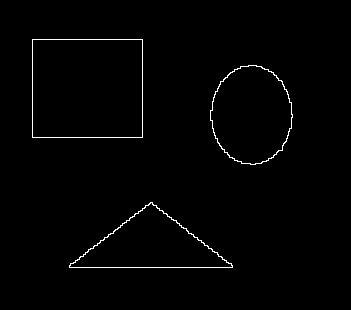

# Morphology-Image-Processing-Point-Detection-Image-Segmentation-and-Thresholding-Hough-Transform
Image Processing project which consists of performing composite morphology operations, point detection, image ssegmentation and linear &amp; circular hough transform on varying input images.
Morphology-Image-Processing-Point-Detection-Image-Segmentation-and-Thresholding-Hough-Transform
Task 1: Morphology Image Processing
What is Morphology?
Morphology in Image Processing is use of a Structuring Element as input on a binary image using a set operator i.e. Union, Intersection, Inclusion & Complement, to change the characteristic shape of the inherent objects in the image. This operation of changing the shape of the objects in the image is dependent on the type & shape of the Structuring Element used. Usually we can consider using a Structuring Element of size 3x3, having an origin of the pixel at the center. This Structuring Element is then moved over all the pixels of the image & its elements are compared with the set of underlying pixels. Hence, when any of the elements matches with the use of set operators, the pixel of the image aligning with the origin of the Structuring Element is set to the value of 0 or 1.

What are the operations used in Morphology?
There are in total two basis operations in Morphology, Dilation & Erosion. Dilation can be defined as an operation used to fill in the black pixels with white ones in a binary image. When we apply, the dilation operation on an image, the effect of the Structuring Element on the image is to gradually extent the boundaries of the objects in the image. Erosion can be defined as an operation used to fill in the enlarge areas with black pixels by adding more black pixels in place of the white ones in a binary image. When we apply, the erosion operation on an image, the effect of the Structuring Element on the image is to gradually erode away the boundaries of the objects in the image.

What is Opening & Closing?
Generally, Erosion & Dilation are considered opposite operations, as they perform entirely opposite operations. But when both the operations are used together, we can perform multiple functions such as removing noise from the image. Two such operations are Opening & Closing. Opening can be defined as a process of performing Erosion and then Dilation in a consecutive manner on a binary image. The total effect of Opening on an image is to preserve the information in the foreground objects, while removing all the other pixels in regions other than foreground. Closing can be defined as a process of performing Dilation and then Erosion in a consecutive manner on a binary image. The total effect of Closing on such an image is to preserve the information in the background objects that have a shape corresponding to the Structuring Element, while removing all the other pixels in regions other than background.

What are the Noise Reduction Algorithms?
In this section of the project, we have used two Noise Reduction Algorithms comprising of Opening & Closing operations. These algorithms are capable of completely removing noise from the image as displayed in the output below. The first algorithm uses the operations of Opening & then Closing (i.e. Erosion, Dilation, Dilation, Erosion) , while the second algorithm used the operations of Closing & then Opening (i.e. Dilation, Erosion, Erosion, Dilation). The first algorithm has the output shown in the image res_noise1.jpg below and the second algorithm has the output shown in the image res_noise2.jpg below.

Why is the output of Opening & Closing operations same?
In this project, we have used a Structuring Element with a size 3x3 and all one values. If we try to compare the sizes of the objects in the image with the size of the Structuring Element, we will realize that all the objects are larger than the Structuring Element in size. This means that whenever we try to apply operation such as Erosion using this Structuring Element on the image, where will be no such case where in a whole object in the image is eroded. We already know that, in Opening we first decrease the size of the objects in the image using Erosion & then increase its size by using Dilation, whereas on the other hand, in Closing we first increase the size of the objects in the image using Dilation & then decrease its size using Erosion. Now, if we compare the process of both the Opening & Closing operations, we realize that even though outputs from both the operations have minimum differences in terms of pixels, the operations do not really change the overall shape & size of the objects after processing. This is because, one operation, first reduces the size of the objects & then increases it back to original size, whereas the other increases the size & then decreases it back to the original size. Hence, because of these fundamental attributes & collective result of the Opening & Closing operations and the Structuring Elements on the image, we can conclude that the outputs generated by both the operations are similar, but not exactly the same in terms of boundaries & number of pixels.

Output:

## Task 2: Image segmentation and point detection
Task 2a: Point Detection:
Point Detection can be defined as a method used in Image Processing to detect points in an image based on discontinuity in the values of pixels of that image. A point in the image can be detected based on its pixel values. Hence, if a pixel exists in the black & white image place, having a value ranging from 0 to 255, then in order for it to be classified as a point, there difference in value of that pixel with its neighboring pixels should be large. For example, a pixel having a value of 234 and is surrounded by pixels with values ranging from 0 to 50, can be considered a point using a Point Detection Algorithm. Here, we use a Laplacian Filter of size 3x3 in order to detect a point as demonstrated in the image below. Co-Ordinates of the point detected are: (249,445)

### Task2b: Image Segmentation & Thresholding: Segmentation is a process of separating pixels in an image that can be used to represent objects of definite shapes and sizes. One of the simplest methods for segmentation is Thresholding. In Thresholding, we sort the pixels based on their intensity i.e. from 0 to 255. Here, we generate a histogram of various pixel densities and their intensity values to generate a better understanding of the background and foreground objects in the image. Once, the histogram is generated we can use various peak values represented by it to identify and segment the required pixels from the noise in the image background. This can be done by setting a threshold value, wherein if the intensity value of the pixel is greater than the threshold, the pixel is considered as a part of the prominent object inside the image & hence is segmented.
Output:
Coordinates of Box1: (162, 124) (124, 203) (162, 165) (203, 165)
Coordinates of Box2: (250, 76) (76, 304) (304, 205) (250, 205)
Coordinates of Box3: (335, 24) (24, 365) (365, 287) (335, 287)
Coordinates of Box4: (387, 41) (41, 425) (425, 253) (387, 253)

Task 3: Hough Transform
Hough Transform can be defined as a technique of detecting lines & circles in an image. One of the most famous application of Hough Transform is Lane Detection for Autonomous Vehicles. The major goal of Hough Transform is that given a set of points in a binary image, we have to find maximum number of lines that can connect these points. For Hough Transform to work we have to represent the points in a Rho(R) & Theta(T) image plane, rather than in a X & Y plane. Hence, if we consider two points in the image plane P1 = (x1, y1) and P2 = (x2, y2), for each ‘T’ values ranging from -90 to 89, etc., we need to calculate the values of corresponding ‘R’ values. Now, if we plot all such points in the image plane, all the points on a line in the plane always intersect at a common point. This common point (R, T) will represent a line in the image plane. In this way, we can detect various lines in an image using Hough Transform.

Hence, in order to perform this task, Hough Transform can be divided into 5 basic operations:

Edge Detection: In this step we use any Edge Detection algorithm such as Sobel Filter, Canny Edge, etc. to generate an image that contains only binary values i.e. 1 value representing edges & 0 representing non-edges in an image. This is the first step of the algorithm & is helpful because, lines & circles can be easily detected using Hough Transform on binary images displaying on the boundaries.
Rho & Theta Range Creation: As we represent all the points of the line using a Rho, Theta plane, we need to create a range of values for both Rho & Theta values. Rho values range along the length of the diagonal of the image. Theta values always range from -90o to 89o Hence, in order to detect all the lines & circles in the image, we need to find the values for Rho & Theta that can provide good tradeoff between accuracy, speed & space of the algorithm.
Hough Accumulator Matrix Generation: This is the third step of the algorithm & is used to calculate the Accumulator Matrix having Rho for X axis & Theta for Y axis. It is called the Accumulator Matrix, as we can accumulate all the points and their voting results in order to detect various lines.
Voting based on Accumulator Matrix: Here, we use the Accumulator Matrix to perform Voting based on the edge point, Rho & Theta values. With the help of the Accumulator Matrix we can calculate the number of occurrences of all points that coincide with a line in the image. Here, for each point values matching the line, we need to increment the number of occurrences by 1.
Peak value detection: The final step of the algorithm uses a method that detects the Local Maxima values in the Accumulator Matrix. These Maxima values represent the lines to be detected in the input image. One such method of detecting Local Maxima, is Thresholding. In thresholding, we point to be a Maxima value only and only if its value is greater than the Threshold value Using these steps in the algorithm, we can successfully detect the Lines & Circles as demonstrated in the output given below.
Output:

Task 3a: Number of Red Lines Detected: 6/6

* Task 3b: Number of Blue Lines Detected: 8/9

* Task 3c: Number of Coins Detected: 17/17

